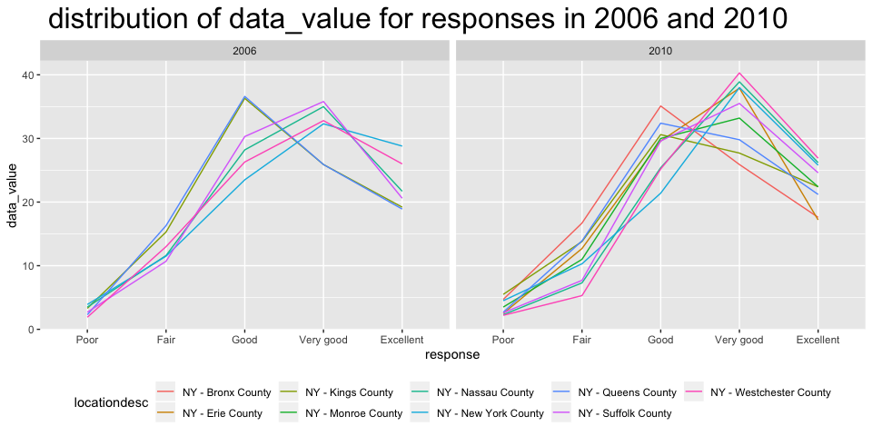

p8105\_hw3\_al3998
================
AimingLiu
10/3/2019

# Load the data from the p8105.datasets

``` r
library(p8105.datasets)
data("instacart")
```

``` r
  aisle_form = instacart %>% 
  group_by(aisle) %>%
  summarize(n = n()) %>% 
  arrange(desc(n)) 
  aisle_num = nrow(aisle_form) 
```

It can be concluded that the row number of instacart is 1384617 and the
column number of instacart is 15. The key variables in this dataset
include user\_id, eval\_set, order\_number, order\_dow,
order\_hour\_of\_day, days\_since\_prior\_order, product\_name and
aisle.And for example,when we see user whose id is 112108 we can know
when he/she bought it and the information about the products. It can be
concluded that the row number of aisle is 134 and the most items ordered
from fresh vegetables

# Making a plot

``` r
  aisle_form %>% 
  filter(n > 10000) %>% 
  ggplot(aes(x = aisle,y = n,fill = aisle))+
    geom_col()+coord_flip()+
  labs(
    title = "Plot about the number of items ordered in each aisle",
    x = "number of items",
    y = "aisle" ,
    caption = "Data from the instacart")+
    theme(legend.position = "bottom")
```

<!-- -->
There are 134 aisle have items ordered more than 10000.The aisle which
was ordered most is fresh vegetables and the number of it is 150609.The
aisle which was ordered least is beauty and the number of it is 287.

# Making a table showing the three most popular items

``` r
 pop_form = instacart %>% 
 filter(aisle %in% c("baking ingredients","dog food care","packaged vegetables fruits")) %>% 
 group_by(aisle,product_name) %>% 
 summarise(n_aisle_product = n()) %>%
 group_by(aisle) %>%
 filter(min_rank(desc(n_aisle_product))<4) 
 
  knitr::kable(pop_form)
```

| aisle                      | product\_name                                 | n\_aisle\_product |
| :------------------------- | :-------------------------------------------- | ----------------: |
| baking ingredients         | Cane Sugar                                    |               336 |
| baking ingredients         | Light Brown Sugar                             |               499 |
| baking ingredients         | Pure Baking Soda                              |               387 |
| dog food care              | Organix Chicken & Brown Rice Recipe           |                28 |
| dog food care              | Small Dog Biscuits                            |                26 |
| dog food care              | Snack Sticks Chicken & Rice Recipe Dog Treats |                30 |
| packaged vegetables fruits | Organic Baby Spinach                          |              9784 |
| packaged vegetables fruits | Organic Blueberries                           |              4966 |
| packaged vegetables fruits | Organic Raspberries                           |              5546 |

The table is a 9\* 3 table.The three most popular items in baking
ingredients are Cane Sugar, Light Brown Sugar, Pure Baking Soda,the
three most popular items in dog food care are Organix Chicken & Brown
Rice Recipe, Small Dog Biscuits, Snack Sticks Chicken & Rice Recipe Dog
Treats,the three most popular items in packaged vegetables fruits are
Organic Baby Spinach, Organic Blueberries, Organic Raspberries.And as we
can see,the number of items in packaged vegetables fruits are much
higher than dog food care which means that packaged vegetables fruits is
the most popular one in these three
aisle.

# Make a table showing the mean hour of the day at which Pink Lady Apples and Coffee Ice Cream are ordered on each day of the week

``` r
  mean_hour_form = instacart %>% 
  filter(product_name %in% c("Pink Lady Apples","Coffee Ice Cream")) %>% 
  group_by(product_name,order_dow) %>% 
  summarize(mean_order = mean(order_hour_of_day)) %>% 
  mutate(order_dow = recode(order_dow,"0"="Sunday","1"="Monday","2"="Tuesday","3"="Wednesday","4"="Thursday","5"="Friday","6"="Saturday")) %>% 
 pivot_wider(names_from = order_dow,
             values_from = mean_order) 
  
 knitr::kable(mean_hour_form)
```

| product\_name    |   Sunday |   Monday |  Tuesday | Wednesday | Thursday |   Friday | Saturday |
| :--------------- | -------: | -------: | -------: | --------: | -------: | -------: | -------: |
| Coffee Ice Cream | 13.77419 | 14.31579 | 15.38095 |  15.31818 | 15.21739 | 12.26316 | 13.83333 |
| Pink Lady Apples | 13.44118 | 11.36000 | 11.70213 |  14.25000 | 11.55172 | 12.78431 | 11.93750 |

This is a 2\* 8 table.As we can see from the result,on each day of a
week,the mean hour of the day at which Pink Lady Apples and Coffee Ice
Cream are ordered are more than 11 and less than 16.And also on each day
of a week,the mean hour of the day in Coffee Ice Cream is larger than
Pink Lady Apples except Friday. \#Problem 2

``` r
  library(p8105.datasets)
  data("brfss_smart2010")
```

``` r
  brfss_form = brfss_smart2010 %>% 
  janitor::clean_names() %>%
  filter(topic =="Overall Health") %>% 
  drop_na(response) %>% 
  mutate(response = factor(response,
                           levels = c("Poor","Fair","Good","Very good","Excellent"),
                           ordered = is.ordered(response))) %>% 
  arrange(desc(response))  
```

``` r
  loco_2002 = filter(brfss_form ,year == "2002") %>% 
  group_by(locationabbr) %>% 
  summarise(count_state =n()) %>% 
  filter(count_state >= 7) 
```

In 2002,the abbreviation of the states which were observed at 7 or more
locations were AZ, CO, CT, DE, FL, GA, HI, ID, IL, IN, KS, LA, MA, MD,
ME, MI, MN, MO, NC, NE, NH, NJ, NV, NY, OH, OK, OR, PA, RI, SC, SD, TN,
TX, UT, VT, WA

``` r
  loco_2010 = filter(brfss_form ,year == "2010") %>% 
  group_by(locationabbr) %>% 
  summarise(count_state =n()) %>% 
  filter(count_state >= 7) 
```

In 2010,the abbreviation of the states which were observed at 7 or more
locations were AL, AR, AZ, CA, CO, CT, DE, FL, GA, HI, IA, ID, IL, IN,
KS, LA, MA, MD, ME, MI, MN, MO, MS, MT, NC, ND, NE, NH, NJ, NM, NV, NY,
OH, OK, OR, PA, RI, SC, SD, TN, TX, UT, VT, WA, WY

``` r
  excellent_form = brfss_form %>% 
  filter(response == "Excellent") %>% 
  group_by(locationabbr,year) %>% 
  summarize(mean_data = mean(data_value,na.rm = TRUE)) 
```

``` r
  average_plot = excellent_form %>% 
  ggplot(aes(x = year,y = mean_data,color = locationabbr ))+
  geom_line()+
  labs(
    title = "Spaghetti Plot",
    x = "Year",
    y = "average of the data value"
  ) 
  
average_plot
```

<!-- -->
The name of x-axis is `Year`,and the name of y-axis is `average of the
data value`.

``` r
 ny_data_1 = brfss_form %>% 
 filter(locationabbr == "NY" & year == "2006") %>% 
 select(locationdesc,response,data_value) %>% 
 ggplot(aes(x = locationdesc ,y = data_value ,color = response, group = response))+
 geom_point(size = 4,alpha = .7)+geom_line() +
  labs(
     title = " distribution of data_value for responses in 2006",
     x = "locationdesc",
     y = "data_value"
  )+ theme(legend.position = "bottom")


 ny_data_2 = brfss_form %>% 
 filter(locationabbr == "NY" & year == "2010") %>% 
 select(locationdesc,response,data_value) %>% 
 ggplot(aes(x = locationdesc ,y = data_value ,color = response ,group = response))+
 geom_point(size = 4,alpha = .7)+geom_line() +
   labs(
     title = " distribution of data_value for responses in 2010",
     x = "locationdesc",
     y = "data_value"
  )+ theme(legend.position = "bottom")

 
 ny_data_1+ny_data_2
```

<!-- -->

As we can see from the two-panel plot,in year 2006,the difference in
data\_value for response `Poor` between different locationdescs is not
very much, so the line is flat.Also,the data\_value for response
`Good`,`Very good` and `Excellent` changed a lot between different
locationdescs,the line of them have ups and downs.

In year 2010,the difference in data\_value for response `Poor` between
different locationdescs is not very much,so the line is flat.Also,the
data\_value for response `Good`,`Very good` changed a lot between
different locationdescs,the line of them have ups and downs.For response
`Good`,the data value in New York country is much lower than other
locationdescs.

\#Problem 3

``` r
  accel_data = read_csv("./accel_data.csv") %>% 
  janitor::clean_names() %>% 
    mutate(weekday_end = case_when(day =="Monday" ~ "weekday",
                                    day =="Tuesday" ~ "weekday",
                                    day =="Wednesday" ~ "weekday",
                                    day =="Thursday" ~ "weekday",
                                    day =="Friday" ~ "weekday",
                                    day =="Saturday" ~ "weekend",
                                    day =="Sunday" ~ "weekend"
                                )) %>% 
  arrange(week,day_id) %>%
  select(1:3,weekday_end,everything()) %>% 
  mutate_if(is.double,as.integer)
```

    ## Parsed with column specification:
    ## cols(
    ##   .default = col_double(),
    ##   day = col_character()
    ## )

    ## See spec(...) for full column specifications.

For the resulting dataset,there are 35 observations and 1444
variables.The data set also include the information about week,day
id,weekday and weekend.

``` r
         total_accel_data = accel_data %>% 
          mutate(accel_sum = rowSums(accel_data[,5:1444])) %>% 
          select(week:weekday_end, accel_sum) 
           
         knitr::kable(total_accel_data)
```

| week | day\_id | day       | weekday\_end | accel\_sum |
| ---: | ------: | :-------- | :----------- | ---------: |
|    1 |       1 | Friday    | weekday      |     480280 |
|    1 |       2 | Monday    | weekday      |      78674 |
|    1 |       3 | Saturday  | weekend      |     376254 |
|    1 |       4 | Sunday    | weekend      |     631105 |
|    1 |       5 | Thursday  | weekday      |     355218 |
|    1 |       6 | Tuesday   | weekday      |     306377 |
|    1 |       7 | Wednesday | weekday      |     339402 |
|    2 |       8 | Friday    | weekday      |     568839 |
|    2 |       9 | Monday    | weekday      |     295431 |
|    2 |      10 | Saturday  | weekend      |     607175 |
|    2 |      11 | Sunday    | weekend      |     422018 |
|    2 |      12 | Thursday  | weekday      |     474048 |
|    2 |      13 | Tuesday   | weekday      |     423245 |
|    2 |      14 | Wednesday | weekday      |     440962 |
|    3 |      15 | Friday    | weekday      |     467420 |
|    3 |      16 | Monday    | weekday      |     685910 |
|    3 |      17 | Saturday  | weekend      |     382928 |
|    3 |      18 | Sunday    | weekend      |     467052 |
|    3 |      19 | Thursday  | weekday      |     371230 |
|    3 |      20 | Tuesday   | weekday      |     381507 |
|    3 |      21 | Wednesday | weekday      |     468869 |
|    4 |      22 | Friday    | weekday      |     154049 |
|    4 |      23 | Monday    | weekday      |     409450 |
|    4 |      24 | Saturday  | weekend      |       1440 |
|    4 |      25 | Sunday    | weekend      |     260617 |
|    4 |      26 | Thursday  | weekday      |     340291 |
|    4 |      27 | Tuesday   | weekday      |     319568 |
|    4 |      28 | Wednesday | weekday      |     434460 |
|    5 |      29 | Friday    | weekday      |     620860 |
|    5 |      30 | Monday    | weekday      |     389080 |
|    5 |      31 | Saturday  | weekend      |       1440 |
|    5 |      32 | Sunday    | weekend      |     138421 |
|    5 |      33 | Thursday  | weekday      |     549658 |
|    5 |      34 | Tuesday   | weekday      |     367824 |
|    5 |      35 | Wednesday | weekday      |     445366 |

``` r
 total_accel_data %>% 
  select(week,day,accel_sum) %>% 
  ggplot(aes(x = week,y = accel_sum,color = day))+
  geom_point(alpha = .5)+geom_line()+
  labs(
    title = "24-hour activity time courses ",
    x = "Week",
    y = "accel_sum"
  )
```

<!-- -->

As we can see from the graphic,the 24-hour activity time courses for
Monday suddenly increases and then decreases,for Tuesday and Wednesday
the lines are smooth,and for Thursday the value of week 5 is much higher
than weeks before.For Friday,its line suddenly drops and then increase
sharply.For Saturday ,its line has a dramatic decline and then there is
no difference in week 4 and 5,and the value is really small compared to
others.The 24-hour activity time courses for Sunday keep decreasing
except week 3.
